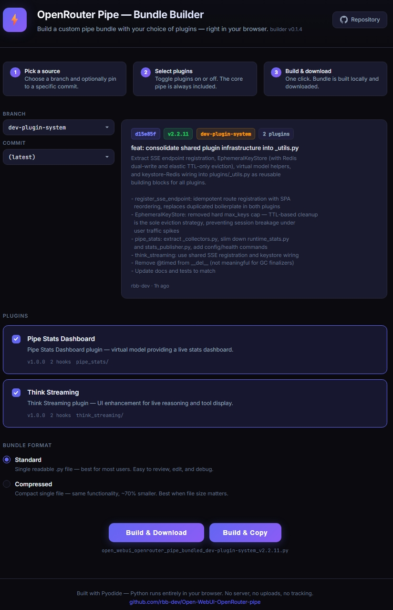

# Bundle Builder — Browser-Based Pipe Bundling

The Bundle Builder is a browser-based tool that assembles the OpenRouter Pipe into a single `.py` file ready for import into Open WebUI. It runs entirely client-side — no server, no uploads, no tracking.

**Live builder:** [rbb-dev.github.io/Open-WebUI-OpenRouter-pipe](https://rbb-dev.github.io/Open-WebUI-OpenRouter-pipe/)

---

## How it works

1. **Pick a source** — Choose a branch and optionally pin to a specific commit.
2. **Select plugins** — Toggle plugins on or off. The core pipe is always included.
3. **Build & download** — One click. The bundle is built locally in your browser and downloaded (or copied to clipboard).

The builder fetches the modular source code from GitHub, runs the same Python bundler script (`scripts/bundle_v2.py`) that CI uses, and produces an identical output — all inside a Web Worker using [Pyodide](https://pyodide.org/) (CPython compiled to WebAssembly).

---

## Features

### Source control
- **Branch selector** — Build from `main` (stable) or any development branch.
- **Commit selector** — Pin to a specific commit for reproducible builds. The last 25 commits are listed with relative timestamps.
- **Commit detail panel** — Shows the selected commit's SHA, pipe version, branch, plugin count, commit message, and author.

### Plugin selection
- Plugins are auto-discovered from the repository's `plugins/` directory.
- Each plugin card shows the plugin name, description, version, hook count, and directory name.
- Click a card to toggle it on or off. Disabled plugins are excluded from the bundle.
- The core pipe and plugin infrastructure (`base.py`, `registry.py`) are always included.

### Bundle formats
| Format | Description |
|--------|-------------|
| **Standard** | Single readable `.py` file. Easy to review, edit, and debug. |
| **Compressed** | Compact single file (~70% smaller). Same functionality; best when file size matters. |

### Output options
- **Build & Download** — Saves the bundle as a `.py` file. The filename includes the format, branch, and version (e.g. `open_webui_openrouter_pipe_bundled_compressed_dev-plugin-system_v2.2.11.py`).
- **Build & Copy** — Copies the bundle source to clipboard. Falls back to download if clipboard access is unavailable (e.g. if the tab loses focus during the build).

---

## Architecture

### Web Worker isolation
Pyodide (the Python-in-WebAssembly runtime) runs inside a dedicated [Web Worker](https://developer.mozilla.org/en-US/docs/Web/API/Web_Workers_API). This provides two key benefits:

1. **Crash resilience** — If the Wasm runtime hits a memory limit or assertion failure, the Worker terminates without crashing the browser tab. The builder catches the crash and shows an error message.
2. **UI responsiveness** — The build runs off the main thread, keeping the UI responsive during the ~15-second Pyodide initialization.

### Pyodide caching
- **Preload on page load** — The Worker is created and Pyodide begins loading as soon as the page opens. By the time you've selected your branch and plugins, the runtime is ready.
- **Persistent across builds** — The Worker stays alive between builds. Pyodide's ~15 MB download and initialization happens once per session. Subsequent builds reuse the cached runtime and only re-run the Python bundler.
- **Clean filesystem** — Between builds, the Worker's virtual filesystem is cleaned (`/build/` directory removed and recreated) so each build starts fresh.

### Build process
1. Fetch the repository tree from the GitHub API.
2. Download all relevant `.py` source files via `raw.githubusercontent.com`.
3. Patch `plugins/__init__.py` to include only the selected plugins.
4. Send files to the Worker, which writes them to Pyodide's virtual filesystem.
5. Execute `bundle_v2.py` inside Pyodide — the same bundler that CI uses.
6. Read the output file and return it to the main thread for download/clipboard.

---

## Requirements

- A modern browser with WebAssembly support (Chrome, Firefox, Edge, Safari).
- Internet access to fetch source files from GitHub and the Pyodide CDN.
- No installation, accounts, or API keys needed.

---

## Troubleshooting

### Build fails with "Python worker crashed"
The Wasm runtime exceeded browser memory limits. This can happen on memory-constrained devices or when the browser imposes tighter limits on hosted pages vs. local files. Try:
- Building from a local copy of `index.html` (clone the repo, open `index.html` directly).
- Selecting fewer plugins.
- Closing other memory-intensive tabs.

### Clipboard copy fails
`navigator.clipboard.writeText()` requires the tab to be focused. If you switch tabs during the build, the copy will fail and the builder will automatically fall back to a file download.

### GitHub API rate limits
The builder uses unauthenticated GitHub API requests (60/hour per IP). If you're doing many builds, you may hit rate limits. Wait an hour or build from a local clone.

---

## Privacy

The builder runs entirely in your browser. Source files are fetched directly from GitHub's public API. No data is sent to any server other than GitHub (for source code) and jsDelivr (for the Pyodide CDN). There is no analytics, telemetry, or tracking.
