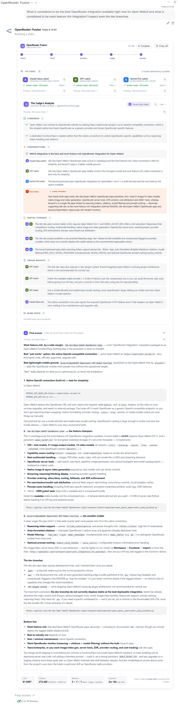

# OpenRouter Fusion

Fusion turns a prompt into a small **multi-model deliberation**: a *panel* of up to 8 models
answers in parallel, a *judge* model produces a structured analysis (consensus, disagreements,
gaps, blind spots), and a final answer is written from that analysis.

The pipe offers two engines behind one valve (`FUSION_BACKEND`).
[OpenRouter's hosted Fusion](https://openrouter.ai/docs/guides/routing/routers/fusion-router) runs
the deliberation on OpenRouter's servers, where the panel's only tool is generic web search. The
pipe's **built-in engine** (the default) runs the same flow as ordinary pipe requests, so the
panel, the judge, and the synthesizer all work with the chatting user's entire Open WebUI
workspace: knowledge bases, personal and workspace tools, and tool servers, always, plus the
`openrouter:*` server tools. The Web Tools filter is never auto-attached to a fusion model, but
its valves are still the source: a member's `openrouter:*` tools come from the admin's
`ENABLE_*` valves **and** the Web Tools filter's stored per-user toggles for the chatting user, read
from the row the pipe installed, whatever id that row carries, so a toggle the user set in another
chat governs the panel. A tool whose `ENABLE_*` valve is off is
never sent to a member. Every call is cost-attributed. Each model streams its answer and its
thinking into the live panel as it works. And where hosted Fusion loses the entire run to one
dropped stream, the built-in engine marks the failed panelist and completes the run. The same
holds for the final-answer stage: a synthesis call that dies mid-stream keeps the text it had
already streamed and closes the turn with a degrade marker naming that failure.

> **Fan-out:** Fusion runs every underlying call — roughly **4–5× a single completion**, and
> it scales with panel size. The panel is wide in flight rather than serialised: every member
> has its upstream call open at once, and the whole fan-out is bounded by a second
> process-wide pool sized from `MAX_CONCURRENT_REQUESTS`, so no more of the panel is in flight
> at a time than that valve allows, whatever the panel's width. The judge and the synthesis
> are serial and draw on the same bound. The Web Tools filter's `SERVER_TOOLS_MAX_COST_USD` rides the same
> fan-out: it is a per-request cap, every call above is its own request and is sent the whole
> cap, so one turn's tool ceiling is that multiple of it. What a model charges is on OpenRouter's
> pricing page. Image generation runs on the turn the person asked for a picture on and is
> cost-attributed like any other tool. It does **not** fan out across the panel: a
> picture-only panel, judge or synthesis member answers the question as an ordinary chat
> call, and starts no image job of its own.

## The "OpenRouter Fusion" filter

The pipe ships a dedicated Open WebUI filter, **OpenRouter Fusion** (`openrouter_fusion`), that exposes
Fusion's options as UI knobs. When the canonical id `openrouter_fusion` is already taken — by a filter
you added yourself, or by another install — the pipe installs and maintains its row under
`openrouter_fusion_1`, `openrouter_fusion_2` and so on, and identifies that row by the source marker it
writes into the filter's code rather than by its id. It injects a `{"id": "fusion", …}` entry into the request's `plugins`
array (the same mechanism as the Web Tools filter). It acts on the fusion models — `openrouter/fusion`,
`openrouter/fusion-flash`, and any `:tag` variant or `:preset/…` form of them — and —
unless an admin opts in — no-ops on every other model.

The filter has two distinct roles:

1. **On the fusion models (auto-attached): configuration only.** Preset, panel models, judge, and
   max tool calls shape *how* the deliberation runs. *Whether* it runs is not the filter's job —
   the pipe forces deliberation on every fusion-model chat request, so `Always run Fusion` is
   redundant there.
2. **On any other model (admin opt-in via `ALLOW_ON_NON_FUSION_MODELS`): fusion as an add-on
   tool.** The filter offers OpenRouter's fusion plugin to an ordinary model, which then decides
   per prompt whether to deliberate — unless the user turns `Always run Fusion` on, which is the
   only place that switch has an effect. This add-on scope is scoped by the master switch in the
   other direction too: with `ENABLE_OPENROUTER_FUSION` **on**, a Fusion entry on a non-fusion
   model is honoured; with it **off**, that entry is removed there as well.

### Activation is guaranteed by the pipe

OpenRouter's fusion aliases answer as a plain single model on `/responses` unless the request
carries an explicit `{"id": "fusion"}` plugins entry — and even with it, invoking the deliberation
tool is left to the model's discretion, which in practice means it randomly answers plain. A
dedicated deliberation model that only sometimes deliberates is useless, so the pipe guarantees it:
every fusion-model chat request gets the plugins entry AND `tool_choice: "required"`. **Fusion
models always deliberate.** This holds even with the filter detached — the filter **configures**
Fusion (panel, judge); it does not gate it. The `openrouter:fusion` **server tool** on your own
model is a different surface and stays optional by design. Exceptions, in the pipe:

- housekeeping/task requests (title, tags, follow-up generation) get neither the entry nor the
  forcing — a chat title must not bill a full deliberation panel;
- a MoA merge (`moa_response_generation`) is the same case one stage later: it is one ordinary
  model call on the aggregator, so it gets neither the entry nor the forcing and no panel, judge
  or synthesis runs for it, whatever `ENABLE_OPENROUTER_FUSION` says. This is named rather than
  folded into the bullet above because the pipe gates it on its own task name, not on "is this
  a task": a task name the pipe has not seen does not inherit the exemption silently;
- with `ENABLE_OPENROUTER_FUSION` off, nothing is injected or forced, and an activating
  `{"id": "fusion"}` entry the request already carries is removed before anything is sent — on any
  model and on either engine — so the master switch genuinely turns Fusion off. A task or title
  request never carries one, whatever the valve says, and every other plugin entry survives, in
  order;
- while Fusion is enabled, a caller-supplied Fusion entry (including
  `{"id": "fusion", "enabled": false}`) is left untouched, so an explicit opt-out disables
  deliberation for that request — and that turn leaves **no panel** and no panel socket either, so
  the message carries no Fusion card at all: a plain model call, and nothing to click.
  A caller-supplied `tool_choice` is left untouched too — except that the master switch outranks a
  caller-supplied `tool_choice: "required"`: once the entry is removed, the pipe's existing rules
  clear a `required` that no tool can satisfy, on `/responses` and on `/chat/completions` alike.

If a `/responses` request falls back to `/chat/completions`, the pipe strips the Fusion plugin entry:
Fusion on that endpoint returns a flattened text transcript with no structured events, so the fallback
answers as a normal completion instead of billing an unrenderable deliberation. That is also why a request
carrying a **live** Fusion entry is not retried at all when `/responses` fails: the chat payload would
lose its panel, so the retry would be a different request, and the provider's error is shown instead.
An entry with `enabled: false`, and a Fusion entry on a non-Fusion model, are still retried. A fusion request
that streams no deliberation events despite an active Fusion entry logs a warning naming the model — the
tripwire for the next time OpenRouter's beta behavior shifts. The fallback path is not exempt from it:
the warning still fires there, and names the `/chat/completions` retry as the cause, so a panel that
never opened because the endpoint switched is on the record rather than passing for a Fusion model
that simply did not deliberate.

### Per-user options (UserValves)

Each user sets these per chat under the filter's controls (the **UI title** is what the user sees;
the **valve** is the underlying `UserValves` field name).

| Valve | UI title | Maps to | Notes |
|-------|----------|---------|-------|
| `FUSION_PRESET` | Preset | `preset` | `general-high` (frontier trio + frontier judge), `general-budget` (faster trio + frontier judge), or `general-fast` (that same faster trio + quicker judge). Empty = `general-high`. Explicit panel/judge below override a preset. **A preset member is subject to the operator's model allowlist and capability filters** (`MODEL_ID`, `FREE_MODEL_FILTER`, `TOOL_CALLING_FILTER`, `ZDR_MODELS_ONLY`); an excluded member appears as a **failed panel member** carrying the reason, and is never silently substituted or dropped. With `ZDR_ENFORCE` or a user's `REQUEST_ZDR` in force, each refused member names the privacy gate rather than the model. The `~` in `~anthropic/claude-opus-latest` is a **routing pin, not an exemption**: an excluded pinned member stays refused unless the admin allowlists it **with the tilde**. |
| `FUSION_ANALYSIS_MODELS` | Panel models (comma-separated) | `analysis_models` | 1–8 model IDs answering in parallel. More than 8 is rejected with a clear error — on every route into a panel, not only this one, and never shortened silently: on the internal backend the pipe refuses the request and shows the panel-too-large card, and on the hosted backend OpenRouter's own 1–8 rule applies. Empty = preset/default panel. Subject to the same model restrictions as a preset member, with one addition: a video- or image-generation model named here is not answered from as a media job. Neither is diverted into the video or image adapter on a panel, judge or synthesis turn, so it answers the question as an ordinary chat call; asking the panel for a clip starts no clip and asking it for a picture starts no dedicated-API image job. A picture-only member still carries `modalities:["image"]` on the chat call, so it can still return a picture in its answer; what stops is the billed job, its progress narrative, its cost record and its stored file. |
| `FUSION_JUDGE_MODEL` | Judge model | `model` | Model that reviews the panel and writes the analysis. Empty = the preset's judge. Subject to the same model restrictions as a preset member. |
| `FUSION_MAX_TOOL_CALLS` | Max tool calls per model | `max_tool_calls` | Tool budget per inner model, 1–16 (`0` leaves it to the engine: 8 on the internal engine, 4 on OpenRouter's). On the OpenRouter engine this caps web-search/fetch steps; on the internal engine it is a hard per-model cap on individual tool invocations (knowledge bases, tool servers, web tools alike — excess calls are skipped) and also bounds tool rounds. |
| `FUSION_FORCE_TOOL_CALL` | Always run Fusion | `tool_choice="required"` | **No effect on the fusion models** — the pipe already forces deliberation there. Matters only on non-fusion models an admin attached the filter to (see below). |

### "Always run Fusion" (forcing)

On the fusion models the pipe already sets `tool_choice="required"` on every chat request, exactly
as [OpenRouter documents](https://openrouter.ai/docs/guides/routing/routers/fusion-router#forcing-fusion-on-every-request)
— this valve adds nothing there. It remains meaningful only when an admin attaches the filter to a
**non-fusion** model via `ALLOW_ON_NON_FUSION_MODELS`: there Fusion stays a tool the model may
decline, and turning **Always run Fusion** on sets `tool_choice="required"` for that chat.

Per OpenRouter: *"If your request also includes other tools, the model may pick one of those
instead."* — extra tools are escape hatches from `required`, and the `openrouter:*` server tools
(web search/fetch/datetime) are the worst offenders: a research prompt makes the model pick web
search over deliberation every time. The pipe closes that hole twice over: the Web Tools filter is
**never auto-attached to fusion models** (their panel and judge already run `openrouter:web_search`
and `openrouter:web_fetch` internally, so outer web tools add nothing), and any `openrouter:*`
server tools that still reach a fusion-model request — a manually attached filter, a leftover
per-chat toggle, a direct API caller — are **stripped before send**. The remaining caveat applies
only to OWUI-native function tools you attach yourself: with those present, the model may satisfy
`required` by calling one of them instead of deliberating.

Both the filter and the pipe leave a caller-supplied `tool_choice` / `function_call` untouched, and
skip forcing when the Fusion plugin is explicitly `enabled:false` (requiring a tool with no active
Fusion would just force some other tool).

There is one case with no escape hatch at all: a **non-fusion** model with *Always run Fusion* on
and **no other tool in the request**. Nothing injects the Fusion tool on a model that is not the
alias, so `required` would be a requirement the model cannot meet. The pipe drops the forced
requirement for that turn rather than sending it. The Fusion plugin entry is still added, so the
model can still call Fusion voluntarily — the request simply does not insist that it does.

There is a second, mirror-image case: a **fusion** model whose Fusion plugin entry is explicitly
`enabled: false`, with **no other tool in the request**. An entry the caller switched off is not a
server-injected Fusion tool, so the requirement has nothing to satisfy it there either, and the
pipe drops it the same way — on the `/responses` leg and on the `/chat/completions` fallback. The
entry itself is still sent: on the OpenRouter engine it configures what Fusion would deliberate
with if it ran, and removing it would change the run rather than the requirement. An entry with no
`enabled` key at all is still active, which is the shape the filter and every other caller
produce.

## Engine backends

The `FUSION_BACKEND` pipe valve chooses which engine actually runs a deliberation when
someone chats with a dedicated fusion model. The live panel, judge analysis, per-chat
controls, and final answer look identical on both.

| | `openrouter` | `internal` (default) |
|---|---|---|
| Where the panel runs | OpenRouter's servers | Inside the pipe, as ordinary pipe model calls |
| Panel tools | OpenRouter web search + fetch only | The full Open WebUI tool surface, run inside the pipe in either outer mode: knowledge bases, tool servers, and the `openrouter:*` server tools. A member's `openrouter:*` tools come from the admin's `ENABLE_*` valves **and** the Web Tools filter's stored per-user toggles for the chatting user, read from the row the pipe installed whatever id that row carries, so a per-chat toggle set on *another* chat governs the panel; a valve that is off sends no such tool. Image generation does not reach a member or the synthesis call: a picture-only member answers on the chat path instead, and its image call is cost-attributed like any other tool. Every tool the maintained row offers reaches every member; the outer turn may only add to that set, and its own parameters win on a key it names; the `ENABLE_*` valves are the authority on whether any of them is sent. **Which row a member reads:** the copy the pipe maintains — the row under the id `openrouter_web_tools` where the pipe owns one there, and otherwise the newest copy the pipe itself maintains, whatever id that copy ended up carrying. A row the pipe does not own is never read as configuration and never loaded as code — with the one exception the installer's own rule makes: a row whose stored source is byte-identical to what this copy would render at that id. That row is provably the pipe's own code (it came out of this same renderer), so the pipe attaches it rather than writing to it, and it is the row it then maintains; no third-party row can reach that arm. Under `ask` approval a member is offered none of Open WebUI's tools. A member's registry — and the `ask_user` builtin names it carries — are the member's own, never the outer turn's: the panelist is never judged against a name collision or a withheld-tool set the outer turn happened to have |
| Per-model dials | OpenRouter's own settings | Every pipe dial per member: ZDR/provider routing, reasoning effort, max output tokens, identity headers |
| Cost attribution | One OpenRouter charge | Every inner call is cost-attributed to the user like a normal chat; the run's footer shows the aggregated total |
| Failure behaviour | A dropped stream loses the whole run | One failed member degrades that card — a member that exhausts its own chat retries is a failed member, like any other failure — and the judge works from the survivors; a member that would have been diverted into media generation is not diverted at all: a video-model or image-model panel member, judge or synthesis member takes the ordinary chat path and answers as a member, because starting a media job from a panel turn creates one and answers the panel with a job card rather than an opinion (a member whose text is exactly `help` still renders that model's controls card and is not a failed member); a member refused before its request was sent reports a short reason naming the control that refused it (Zero Data Retention routing, that OpenRouter's Zero Data Retention endpoint list could not be read, Direct Uploads injection, an endpoint override conflict, or the operator's model restrictions), never a copy of the rendered error card behind it, so nothing that card happened to quote reaches the panel, the judge or the synthesiser; the run completes. A member whose request did go out and whose call then failed is never reported as a member that had nothing to say: its reason says the request was sent and the model call then failed, which is the one sentence true for a stream that ended without a completion event. A member no longer reaches the image or video adapters at all, so a generation failure of its own is a top-level-arm outcome, not a member outcome. Only a member that ran to completion and produced nothing keeps the `the model returned no answer` wording. A member the pipe never asked is never reported as a member that refused. A panel member that is cut off after it produced text has answered and is not retried: its partial draft is kept and a marker naming the interruption is appended, and that marked draft is what reaches the judge input, the synthesis material, the panel card and the stored `done` item, so a member that was cut is never read as one that finished. The incomplete warning for a member that was length-capped reaches the member and is deduped per run like any other member notice. A member that dies after streaming is the same shape on every stage, panel and synthesis alike: its partial is kept (the user watched it stream in, and it is not retried) and the stage's failure note is **appended**, never substituted for it — the delivered text stays the prefix, and the note rides after it on the panel card, in the judge input, in the synthesis material and in the stored `done` item. A member's delivered text is the text its own model delivered: the pipe's own error card, which the failure path renders on top of whatever had already streamed, is a diagnostic for the operator and is never kept as the member's answer, so a member that failed is judged on what it said before it failed and on nothing else. A member that returned nothing, that was refused before its request went out, or that failed before its model streamed anything, shows the note alone. A synthesis member that dies mid-stream or is cut off after it produced text is that same rule on the answer stage, and its marker is **part of the stored reply**, not a transient toast. It is in every `response.output_text.delta`, in the string the turn returns, and in the assistant message Open WebUI persists. A member whose context budget trimmed or dropped history, or whose reasoning dial could not be honoured, tells the person **once for the whole run**, naming the member — that is the row that answers "why did that panelist ignore my chat". When *every* member fails the run still returns a well-formed answer — on a **Direct Connection** too, which gets the answer text and the error archive row but no panel, no `fusion:event` stream and no embed — and the session-log archive records that turn as an error. A synthesis step that fails with no output of its own is the same for a Direct Connection: it also gets the answer text, and that turn archives `complete`, not `error`, because the panel did answer. On *any* total panel failure the outer archive row reads the fixed string `Every Fusion panel member failed; this run has no deliberated answer.` — the provider status is on the inner per-member rows only only when no member answered at all |
| Tool budget (`max_tool_calls`) | Caps web search/fetch steps; unset means OpenRouter's own default of `4` | Hard per-model cap on individual tool invocations, plus a bound on tool rounds; unset means this pipe's own default of `8` |

Behaviour shared by both engines:

- A panel member's **attachment refusals are not surfaced to the person**, before or after this change. `FusionCollector` has no branch for a status event, so a member's own `Files: skipped N (…)` is discarded inside the collector, and every member re-runs the whole transform on the raw messages, so a link the address gate refuses is re-checked once per member and the person is told nothing on a fusion turn. The same was already true of the cleartext and oversized rules; it is recorded here because the address gate is a rule a member can newly hit, and the fix for it must not be to card the refusal — that would surface once per member on a channel that today reports none of them.
- A panel member that is an **image model, on a turn whose text is exactly `help`, answers**: it renders the model's controls card, and that card is its draft, carried into the panel item, the judge prompt and the synthesis material like any other. It is not a failed member. Without this an operator reads an image model quoted in a judge prompt as a bug.
- Deliberation is **guaranteed** on fusion-model chats — the internal engine always
  deliberates; the OpenRouter engine is forced via `tool_choice: "required"`.
- A caller-supplied `{"id": "fusion", "enabled": false}` plugins entry is an explicit
  opt-out on **both** engines: the request runs as a plain model call. The turn shows no
  deliberation panel and no `fusion:event` either, so the message carries no Fusion card at all —
  a plain model call, and nothing to click.
- Task/title generation requests never deliberate.
- The *Always run Fusion* user toggle is inert on fusion models for both engines, and
  the add-on server-tool surface on non-fusion models always uses OpenRouter's plugin
  regardless of `FUSION_BACKEND`.

On the internal engine the three stages are prompted by admin-editable templates
(`FUSION_PANEL_SYSTEM_PROMPT`, `FUSION_JUDGE_SYSTEM_PROMPT`,
`FUSION_SYNTHESIS_SYSTEM_PROMPT`); clearing any one of the three boxes, or leaving only
whitespace in it, restores that stage's shipped default, and a template that has content
is sent to that stage verbatim, whitespace and all. The judge runs at temperature 0 and must return a
strict five-key JSON analysis; if it fails validation twice the run degrades to
no-analysis mode (panel answers stay usable, synthesis proceeds from the raw drafts).
The same no-analysis mode applies to a judge whose own call failed after its analysis
arrived — a faulted member is not a verdict, so nothing it produced reaches the run.
The final answer is written by the preset's judge model from the panel drafts plus the
analysis. The synthesis material — the panel drafts and the analysis as one block — sits
in the body as a **second leading `system` block**, after that stage's own prompt and
before the conversation, so it reads as reference data ahead of the exchange it describes
and the user's question stays last. Preset rosters are engine constants: `general-high` = the self-updating
`~…-latest` frontier trio judged by an Opus-class model; `general-budget` = a faster
trio with the same judge; `general-fast` = that same faster trio with a Sonnet-class judge.
Note: `FORCE_*` provider-glob valves match model IDs literally, so tilde aliases only
match patterns written with the leading `~`.

**Write preset members in `MODEL_ID` with the tilde, not without it.** A `~`-pinned member
is compared as its own identity: `~anthropic/claude-opus-latest` is a different model from
`anthropic/claude-opus-latest` for every allowlist comparison, and the tilde is what
OpenRouter reads as "route to the latest release". So `MODEL_ID=anthropic/claude-opus-latest`
publishes **no** models at all — the untilded entries in the catalog are dated
(`anthropic/claude-opus-4`, `-4.1`, … `-4.8`), while only `~anthropic/claude-opus-latest`
exists as a `…-latest` entry. An operator whose allowlist is written without the tilde
never reaches Fusion; one whose allowlist is narrower than the preset's panel sees the
excluded members fail, each with a reason naming the control that refused it.
The same tilde rule applies to the `MODEL_ID` glob arm, and it fails just as quietly: a `*`
pattern does not cover a `~`-pinned alias, so `MODEL_ID=openai/*` publishes none of the
three `general-high` members named above and every panel member fails. To remove one, exclude
it as `!~openai/*`; to admit one, include it as `~openai/*` or `~*`.

On the internal engine, every panel, judge and final-answer call is made as the chatting user's own call. A run counts toward that user's request breaker once, not once per call: it spends one failure when no panel model answered, and none at all when one did, however wide the panel is or however many of its calls failed. When the run ends, the count, including that run's own failure, is cleared if the run finishes and any panel model answered, and kept if none did or the user stopped the run. The breaker never cuts off a run already under way; only the user's next request can be refused. Within each run, all of its models share one count per tool: once a tool fails `BREAKER_MAX_FAILURES` times in a row, it is skipped from then on, even after a quiet spell, unless a call to it that was already running succeeds. The user's own tool breaker for normal chats is left untouched. See [Concurrency Controls & Resilience](concurrency_controls_and_resilience.md).

A notice any stage of the run computes — a context-budget warning, or a reasoning dial that could not be honoured — reaches the person once for the run, deduped by text: the first member to raise a given wording raises it, and later members repeating it add nothing. Two members with different context limits produce two different notices and both are said; two that hit the same limit produce one, because a panel that all trimmed must not produce a toast per member. Nothing else a member emits is forwarded — its error card, its tool labels and its image notes stay inside the run. The published line names the stage that raised it, not just the model: a notice a panel member computes reads `<model> (panel member): …`, one the judge or its repair pass computes reads `<model> (judge): …`, and one the synthesis model computes reads `<model> (final answer): …`. The judge and the synthesis model are not panel members, and naming them as one told the person the wrong stage had dropped something.

## Enablement — pipe valves (admin)

These live on the **pipe** (the OpenRouter manifold's `Valves`) and control install/attach/default
wiring. They are documented alongside the other pipe valves in
[valves_and_configuration_atlas.md](valves_and_configuration_atlas.md).

| Valve | Default | Effect |
|-------|---------|--------|
| `ENABLE_OPENROUTER_FUSION` | `True` | Master switch; installs the filter, auto-wires it to the fusion models only, and gates the pipe's activation injection. `False` deactivates the installed filter on the next `pipes()` call, stops injecting the Fusion plugin entry, and removes an activating `{"id": "fusion"}` entry the request already carried, on any model and either engine — Fusion is then fully off for the first time — and a task or title request never carries one, and neither does a MoA merge. `AUTO_INSTALL_FUSION_FILTER` is the install valve for that family. Setting it back to `True` re-activates a filter the pipe itself switched off whose family's install valve is still on, on the next `pipes()` call — including an install-by-hand copy, which nothing else brings back; a row that valve has retired stays off until that valve comes back on. A row the pipe re-arms comes back private rather than shared: Open WebUI puts every filter marked Global at the front of every model's list, so a row an admin made Global is made private again in the same write that re-enables it. A filter an admin switched off by hand — after the pipe had switched it off — stays off. |
| `AUTO_INSTALL_FUSION_FILTER` | `True` | Install/update the filter function in OWUI. It also delivers the filter's own fixes: they live in the stored row rather than in the pipe, so with it off an installed row keeps whatever code it already had. |
| `AUTO_ATTACH_FUSION_FILTER` | `True` | Attach the filter to the fusion models **only** (never other models) — including their `:tag` variant and `:preset/…` rows. Neither does a pass that could not install the panel because Open WebUI refused the write: the attached filter and the default it carried stay, and the install is tried again at the next pass. |
| `AUTO_DEFAULT_FUSION_FILTER` | `True` | Pre-enable the filter per chat on the fusion models (does not force Fusion to run). |

The fusion models are auto-wired because access to them is already governed by Open
WebUI's model ACLs. The filter is **never** auto-attached to any other model.

**Attach and detach lifecycle.** The filter comes off a fusion model when
`AUTO_ATTACH_FUSION_FILTER` is turned off, or when the model stops being a fusion
model — not because a catalog pass failed to find it. In particular, running with
`AUTO_INSTALL_FUSION_FILTER=False` and `AUTO_ATTACH_FUSION_FILTER=True`, the
install-by-hand mode, keeps whatever is already attached: a pass that finds no panel
leaves the attached filter and the default the pipe seeded in place, and the next
catalog fetch tries again. Neither does a pass that could not install the panel because Open WebUI refused the write: the attached filter and the default it carried stay, and the install is tried again at the next pass. A filter the pipe switched off itself comes back when the master switch returns, private rather than shared: Open WebUI puts every filter marked Global at the front of every model's list, so a row an admin made Global is made private again in the same write that re-enables it.

### `openrouter/fusion-flash` (forward-compat)

OpenRouter documents a faster `openrouter/fusion-flash` alias (the `general-fast` preset pinned as its
own model), but it is not live on the API yet. The pipe already treats it as a full member of the
fusion model family — endpoint forcing, the live panel, filter auto-wiring, the activation injection,
and `tool_choice: "required"` all apply automatically once OpenRouter ships it and it appears in the
catalog. Filter updates reach installed deployments via `AUTO_INSTALL_FUSION_FILTER`; attach-only
deployments (auto-install off) keep their existing filter copy, which does not recognize flash until
it is reinstalled.

## Live deliberation panel

Every `openrouter/fusion` chat automatically renders the deliberation — preamble intent, per-model panels, the
judge's analysis, the final answer, and cost — as a live, theme-aware HTML panel. A message carries one Fusion card,
updated in place: each deliberation event is pushed over Open WebUI's own socket as a custom `fusion:event`
that the panel's same-origin socket connection consumes (no iframe reload → no flashing). The
final answer streams **into** the panel and is also written to the message as a **collapsed `<details>`** — so
multi-turn context, copy, and regenerate read the answer natively (the panel embed is UI-only and is never sent
back to the model), while the visible surface stays the panel.

While the panel deliberates, each model's card is **live**: its status line becomes a ticker showing
the tail of whatever that model is currently producing plus a running word count, streamed from
the engine's per-token panel events (batched by the pipe to a few updates per second per model).
Models that expose reasoning gain a collapsible **Thinking** section on their card — hidden until
reasoning actually arrives, streaming live while expanded, rendered as Markdown on first open, and
kept in the persisted panel for every completed model (a panel still mid-answer at the moment of a
reload recovers its reasoning when it completes). The Thinking section has its own
copy button, and **Copy all** includes each model's thinking alongside its answer. The high-volume
token deltas themselves are never baked into the persisted embed — the full reasoning text is
reattached to each panel's completed event instead, keeping the snapshot small. Whatever a model still has
buffered is flushed to that card first, so the closing burst of its answer is never dropped: the flush runs
at the end of every turn, so a run that ends any other way — the stream simply running out, a member's call
failing, or the person pressing Stop — shows the member's last words too. A turn that handed its tool calls
back for a retry is the one ending it does not flush: the request that comes back re-sends the same panel to
the same card, so a tail flushed on both attempts would show the member's words twice. That is the live card
only, and only for what is still buffered: the reasoning buffers and the persisted panel are recorded from
the raw events before batching, so a run that ends this way has the same embed, the same final answer and the same
session log as one that reaches its boundaries. If OpenRouter stops
streaming panel deltas, the cards simply fill in at completion as before.

- The live panel requires Open WebUI's **iframe same-origin** setting (Settings → Interface → "iframe sandbox
  allow same origin") — the panel reads the session token to open its socket. With it off, the panel still
  renders the complete deliberation **statically** on completion / page reload (from the persisted embed) — just
  not live. The persisted embed is a saved chat the asker owns: on a temporary chat there is no row to write it
  to and nothing to reload, so the panel is live-only there.
- A **browser close** mid-run does not abort the deliberation: Open WebUI runs it as a detached task, so it
  finishes server-side and the full panel + answer are persisted; reopening the chat shows the finished result —
  on a saved chat the asker owns, which is the only place there is anything to reopen.
  On a **Continue** of that answer the panel is added to the stored row and the stored answer itself is left to
  Open WebUI, which holds the prefix this generation does not carry.
- A mid-stream **socket drop** has no live replay; reloading restores the complete panel from the persisted state.
- A Fusion answer cut off by a length or provider cap is a **finished** run, not an interruption: the footer, the clock and the cost render exactly as they do for a completed turn.
- A **dropped connection or a raised tool** is the other way round, and is not a finished run: the turn wrote no
  final panel, so a reload shows the error above the live panel rather than a deliberation frozen at "—" and
  presented as finished. A `final=True` panel is what a finished run persists, and it never opens a socket again,
  so it is written only for a turn that shipped its answer, on a chat the caller owns (or, for an admin, any
  saved chat). A channel's panel is delivered by Open WebUI's own channel emitter, not by this write.

- Forces the `/responses` endpoint (the only one that emits the granular Fusion events). A
  `FORCE_CHAT_COMPLETIONS_MODELS` match on the fusion model is **not** overridden: a pattern naming
  `openrouter/fusion` reaches that model's tagged spellings as well as the bare id, so
  `openrouter/fusion:nitro` and `openrouter/fusion:free` are refused exactly as the bare row is. On the hosted OpenRouter backend
  the valve holds and the turn is refused with the endpoint-conflict card, because Fusion on `/chat/completions` returns a
  flattened text transcript with no structured events. The pin is kept and the request does not run. On the internal backend the panel runs
  inside the pipe and the fusion model never reaches OpenRouter, so there is no endpoint conflict to refuse and the
  turn runs the panel — *unless* the turn has opted out or is a housekeeping task request: with no panel to run, the
  model does reach OpenRouter and the pin refuses it with the same card. Both of those turns are described under
  [Engine backends](#engine-backends), where the per-request `{"id": "fusion", "enabled": false}` entry and the
  task requests that never deliberate are set out.
- No effect on **Direct Connections** — Open WebUI does not deliver in-chat embeds on that path. A valve-pinned Fusion model is still refused there with the endpoint-conflict card, as it is anywhere else on the hosted backend.
- Automatic on the fusion models — `openrouter/fusion`, `openrouter/fusion-flash` and their `:tag` / `:preset/…` forms — whenever Fusion is enabled: the master `ENABLE_OPENROUTER_FUSION` switch is on, the model is a fusion model, the turn is not a Direct Connection, **and** the turn's Fusion entry is not `enabled: false`. The master switch turns it off along with the rest of Fusion, and so does the per-request opt-out — a chat whose Fusion entry is disabled gets no panel and no panel socket. Non-fusion models are never affected.

### Socket transport — network & CSP requirements (admin)

The live panel runs inside Open WebUI's sandboxed embed iframe and opens its **own** authenticated
Socket.IO connection back to this instance to receive `fusion:event` updates. It authenticates the
**same way Open WebUI's own client does**: it reads the signed-in user's session token from
`localStorage` and sends it as the Socket.IO handshake `auth: { token }`, which the server decodes to
join that user's event room. No separate credential is minted or embedded — which is also why the
**iframe same-origin** setting (above) is required: without it the iframe is a distinct origin, cannot
read the token, and the panel stays static.

Neither the panel nor its socket is created for a chat whose Fusion entry is `enabled: false`, and
neither is created for a turn that will not deliberate for any other reason — so the token above is
read only for a run that is actually going to stream events into it.

Because the embed is a `srcdoc` document (origin `about:srcdoc`), it cannot reuse Open WebUI's bundled,
module-scoped `socket.io-client`. Instead the Socket.IO client is **inlined directly into the panel
HTML at build time** — there is **no runtime CDN fetch and no external script dependency**. The client
is **version-pinned** (socket.io-client 4.8.3) and its exact bytes are **verified against a pinned SHA-384 digest at build time**, so a
substituted or tampered client can never be inlined into the shipped template. (Inlining adds
no new outbound network requirement — at runtime the panel only needs the WebSocket back to this
instance.)

By default this needs no configuration — Open WebUI injects **no** CSP into embeds unless `IFRAME_CSP`
is set (an empty policy is returned unchanged). **If you set `IFRAME_CSP`**, the live panel requires:

| Capability | Directive | Minimum to allow |
|------------|-----------|------------------|
| Panel's own inline script (includes the inlined Socket.IO client) | `script-src` | `'unsafe-inline'` |
| WebSocket back to this instance | `connect-src` | this origin (`'self'`; also add `wss:`/`ws:` if your policy is scheme-explicit) |

Because the Socket.IO client is inlined rather than fetched, a single `script-src 'unsafe-inline'`
covers both the panel logic and the socket client — no external script host needs allow-listing.

Example scoped policy:

```
IFRAME_CSP="default-src 'none'; script-src 'unsafe-inline'; style-src 'unsafe-inline'; connect-src 'self'; img-src 'self' data:"
```

The failure mode is **non-fatal**: if `connect-src` omits this origin (or `script-src` omits
`'unsafe-inline'`) the socket never opens, and the panel degrades to the fully-rendered **static**
deliberation (from the persisted embed) with no live streaming and no error. This is the same fallback
as running with the **iframe same-origin** setting off (above), where the panel cannot read the session
token to authenticate the socket.

## Filter admin valves (on the filter itself)

These are **separate** from the pipe valves above. They live on the **filter's own** `Valves`, edited
at *Admin → Functions → OpenRouter Fusion → ⚙ valves*. They are not per-user — they apply to every
chat that uses the filter.

| Valve | Default | Effect |
|-------|---------|--------|
| `ALLOW_ON_NON_FUSION_MODELS` | `False` | **Off (default):** the filter acts only on the fusion models — `openrouter/fusion`, `openrouter/fusion-flash` and their `:tag` / `:preset/…` / `~` forms. If you attach it to **any other model**, its inlet returns immediately and injects nothing — no Fusion plugin, no `tool_choice` forcing — so a user's *Preset / Panel / Judge / **Always run Fusion*** settings have **no effect** on that model. **On:** the filter adds the Fusion panel (and forcing, if the user enabled *Always run Fusion*) to **any** model it is attached to. This valve is the **only** way to use Fusion on a **non-fusion** model: manually attach the filter to that model, then turn this on. (The model must also support tool calling, since forcing sets `tool_choice="required"` — though the forcing is dropped for a single turn that offers no tool at all.) |
| `priority` | `0` | Filter execution order. OWUI runs a chat's attached filters sorted by `(priority, id)`, lowest first. |

> **Gotcha:** attaching the filter to another model and enabling *Always run Fusion* does **nothing**
> while `ALLOW_ON_NON_FUSION_MODELS` is `False` — the inlet bails out before it can inject the plugin
> or set `tool_choice`. Turn this valve on first.

## What a deliberation looks like


