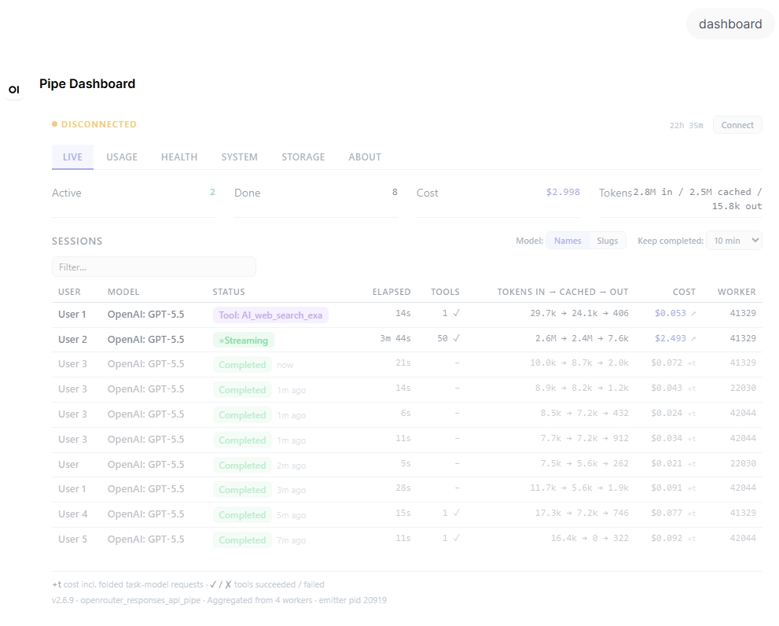
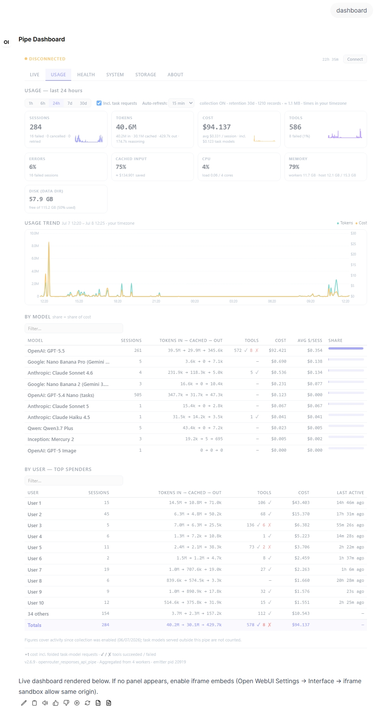
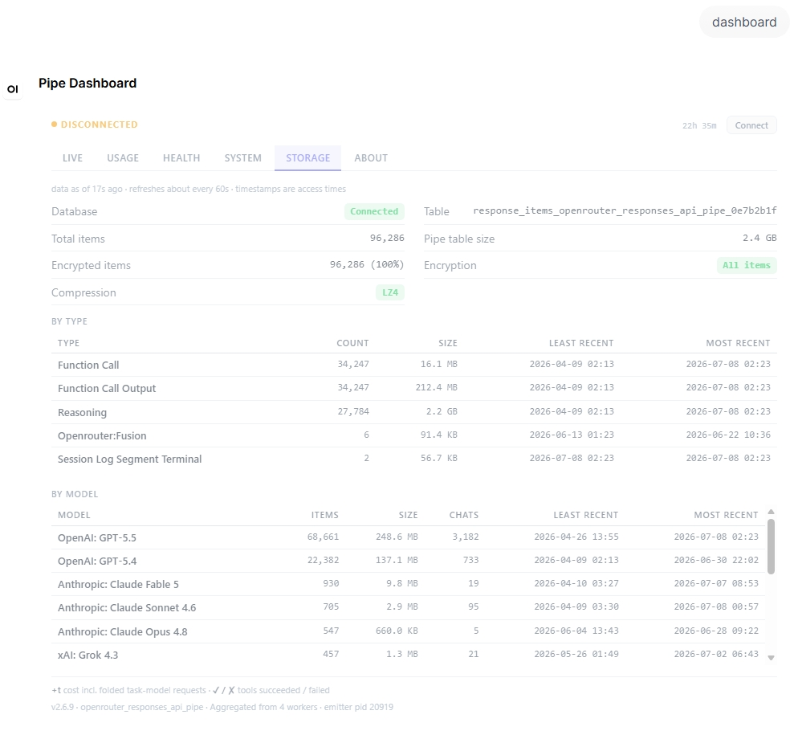
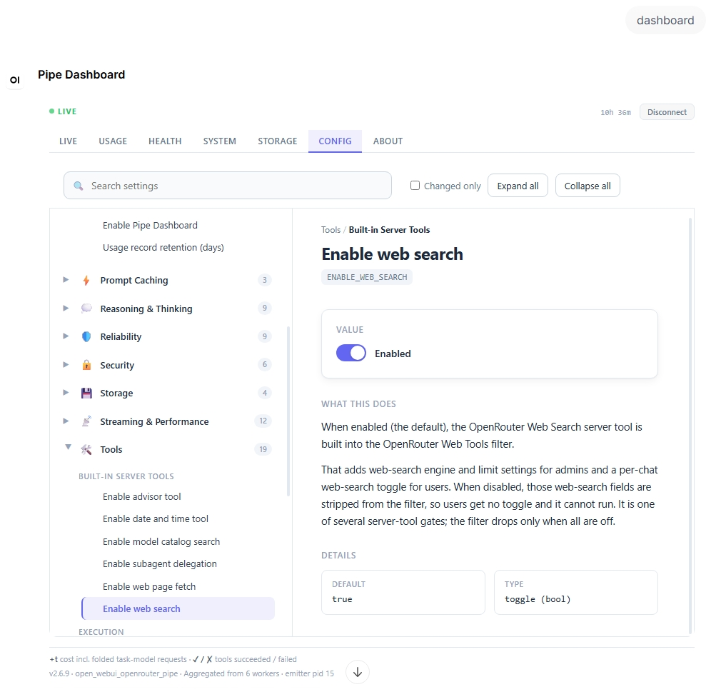

# Pipe Dashboard Plugin — Operations Guide

An admin dashboard and configuration editor exposed as a virtual model in Open WebUI.

1. [Overview](#overview)
2. [Access](#access)
3. [Opening it](#opening-it)
4. [The dashboard](#the-dashboard)
5. [Editing configuration](#editing-configuration)
6. [Live configuration updates](#live-configuration-updates)
7. [Requirements](#requirements)
8. [See Also](#see-also)

---

## Overview

Selecting the **Pipe Dashboard** model in Open WebUI turns the chat box into an admin console. The console offers two things at a glance: a live operations dashboard — requests, resources, and storage tracked in real time — and an editable configuration panel for the pipe's admin valves.

The dashboard is part of the pipe's plugin system, which ships off. Two valves switch it on, in order:

1. `ENABLE_PLUGIN_SYSTEM` — the master switch for the plugin system (default: off). Set it on before any plugin loads.
2. `PIPE_DASHBOARD_ENABLE` — adds the Pipe Dashboard model to the selector.

Three admin valves control the feature. They appear in Open WebUI's Settings once the plugin system is enabled.

| Valve | Type | Default | What it does |
|-------|------|---------|--------------|
| `PIPE_DASHBOARD_ENABLE` | bool | `False` | Shows or hides the Pipe Dashboard model in the model selector. |
| `PIPE_DASHBOARD_USAGE_COLLECT` | bool | `False` | Records one usage entry per completed request (user, model, tokens, tools, cost) to power the Usage tab. Read live: turning it on starts recording without a restart. |
| `PIPE_DASHBOARD_USAGE_RETENTION_DAYS` | int | `30` | How long usage records are kept. A background purge removes older records. Read live. |

---

## Access

Access is governed by Open WebUI's model access control on this overlay model — there is no separate admin flag. Assign users and groups in the model's **Access** editor:

- A **read** grant makes a **viewer**: open the dashboard and watch the live feed.
- A **write** grant makes an **operator**: everything a viewer can do, plus edit configuration and use the action buttons.

Owners and admins hold both grants. A user with no grant receives an access-denied message.

---

## Opening it

Select **Pipe Dashboard** in the model dropdown, then type a command and send it.

| Command | What it does |
|---------|--------------|
| `dashboard` | Opens the live console. |
| `help` | Lists the available commands. |

An empty message opens `help`. An unrecognized word returns a short notice pointing back to `help`.

---

## The dashboard

The `dashboard` command opens a console organized into tabs. Each tab covers one area of the pipe's operation.

### Live

The Live tab shows one row per in-flight or recently-completed request, across every worker. Each row carries:

- User and model. The model column shows display names and toggles to model slugs.
- A status badge: `queued`, `streaming`, `tool:<name>`, `completed`, `failed`, or `cancelled`.
- Elapsed time, tool success and failure counts, tokens (in → cached → out), cost, and the worker PID.

Cost updates live as the request runs; the completed row shows the final cost. Task-model calls — titles, tags, follow-ups — fold their cost into their parent chat's row.

Completed rows stay visible, dimmed, for the **Keep completed** window (5 minutes to 3 hours, default 10 minutes), set in the table itself.

The table sorts on any column and has a filter box.

### Usage

The Usage tab needs `PIPE_DASHBOARD_USAGE_COLLECT` on. Without it, the tab shows a hint to enable collection.

With collection on, the tab presents:

- **Metric cards** — Sessions, Tokens, Cost, Tools, Errors, and Cached input, each with a change chip against the previous period of equal length and a per-bucket sparkline.
- **Resource cards** — live CPU, Memory, and Disk.
- **Usage trend** — a chart with two lines per bucket: tokens (left axis) and cost (right axis), with a hover tooltip and a timezone-aware range caption.
- **By model** — cost share per model. Each task-model appears as its own `model (tasks)` row with its own cost.
- **By user** — sorted by cost, showing the top 10 with an "N others" roll-up. Search and column-sort reach every user, including those inside the roll-up. A pinned **Totals** row at the bottom sums the visible rows (sessions, tokens, tools, cost).

Select a range: 1h, 6h, 24h, 7d, or 30d. Ranges longer than the retention window are disabled. A footnote shows the collection-start date, the retention window, and the record count.

**Invoice note.** Task models configured outside this pipe never reach it, so they are absent from these totals. Expect a small gap against the OpenRouter invoice when such task models are in use.

The Usage tables sort on any column and have a filter box.

### Health

The Health tab tracks the pipe's live load:

- **Concurrency** — active requests and tools, in-flight calls, and active video generations when the video pool is configured.
- **Queues** — pending requests and the log and archive queue depths, each with its bound.
- **User Circuit Breakers** — request, tool, and auth breaker counts. "Seen" counts distinct users since the worker started; "Users w/ fail" counts users with recent failures.
- **Models** — the model catalog with a per-type breakdown (text, image, video), the ZDR-capable count, and per-type fetch clocks. The status badge tracks the chat-catalog fetch loop.

### System

The System tab covers readiness and infrastructure:

- **Readiness** — initialization state, HTTP session, the session-logging worker, log-buffer RAM usage, and pipe-level Redis with a liveness ping. The session-logging worker reads **Idle** until the first record is persisted, which is its normal starting state.
- **Artifact DB** — the database write-pool backlog and the database circuit-breaker states.
- **Workers** — per worker: PID, uptime, active-request count, last-seen age, and a status badge (Active, Stale, or Warmup failed). This card appears in every deployment.

### Storage

The Storage tab summarizes the artifact store:

- **Storage Overview** — total items, total size, and the encryption and compression modes.
- **By Type** — item counts and sizes grouped by artifact type.
- **By Model** — a scrollable table of per-model storage usage.

### Config

The Config tab lists every admin valve for editing in place. See [Editing configuration](#editing-configuration) and [Live configuration updates](#live-configuration-updates) below.

### Update

The Update tab self-updates the pipe from tagged GitHub releases of the repo configured in
`PIPE_DASHBOARD_UPDATE_REPO` (the upstream project by default; point it at a fork to ship your own
builds — forks inherit the release workflow, so assets, digests, and the changelog keep working).

- **Installed / Latest cards** — installed version with a flat/compressed variant badge (locally
  derived; the card shows no dates — the row's timestamps are modification times, not install
  times, and a release date belongs to the release, shown on the Latest card); the latest release with date, size, "Last checked" (the last *successful* check; a
  separate line appears while checks are failing), the tracked repo (with a `fork` badge when it is
  not the default), and the auto-update status. Every visit to the tab refreshes its data (release
  data is memoized server-side for a minute, so tab switching never hammers GitHub). **Check now**
  bypasses that memo for admins; for read-only viewers it refreshes the installed/snapshot state
  but reuses the memoized release data — force-refreshing the shared GitHub budget is admin-only.
- **Changelog** — the release page's own generated notes, rendered as escaped text; commit
  references appear as plain code text, not clickable links (the sandboxed panel cannot open new
  tabs). A fork that strips its CI ships no notes; the block then reads "changelog unavailable".
- **Update / Reinstall** — opens a confirm modal showing from→to, size, and a **Compressed bundle**
  checkbox preselected to the installed variant (an unavailable variant is disabled; `no_plugins`
  bundles are never offered — they would remove this dashboard). When you are already on the latest
  version the button reads **Reinstall** and re-applies the same release — that is the tab-native way
  to switch between the flat and compressed variants. Downgrades are refused here; restore a snapshot
  instead. Releases older than 2.7.0 — the first release carrying this tab — are refused outright:
  installing one would remove the updater itself. Applying downloads the asset (8 MiB cap), verifies its
  sha256 against the release digest, checks the frontmatter (id, newer version, required Open WebUI
  version), snapshots the current code, exec-validates the new bundle through Open WebUI's own
  loader, and only then writes the function row — and verifies the database accepted the write,
  failing the update loudly instead of reporting a success that did not persist. A load failure
  surfaces the real error in the tab and the pipe keeps serving the old code. The installing worker pauses briefly (up to ~90s); other
  workers pick the new version up on their next request. After a successful update, reload the
  dashboard to load the matching UI.
- **Previous versions** — the retained snapshots (`PIPE_DASHBOARD_UPDATE_SNAPSHOT_KEEP`) with
  Restore and Delete. Both use a click-again confirmation: the first click arms the button
  (**Confirm restore** / **Confirm delete**, shown in red) and the second click within five seconds
  executes — native browser dialogs cannot appear inside the sandboxed panel, so the confirmation
  lives in the button itself. The Actor column shows the account name of whoever took the snapshot
  (`auto` for the auto-updater). Snapshots are stored as a fixed set of dedicated records in Open WebUI's own
  Files storage with their metadata (version, checksum, date, actor) on the file record itself —
  nothing about them lives in the function entry, so editing or re-pasting the function in the
  admin panel can never erase the rollback list. A restore re-validates the snapshot against its
  pinned sha256 before loading it, and snapshots the current code first, so restores are themselves
  undoable. Delete double-checks the snapshot is still the one shown in the list before removing
  it and refuses with a refresh prompt if it changed. Snapshot records are owned by the primary
  admin account and are ordinary Open WebUI file records under the hood (there is no general file
  browser in the Open WebUI UI, so they stay out of the way, but they are listable through the
  files API) — manage them from this tab only: deleting them elsewhere, including the admin
  "delete all files" maintenance action, destroys rollback points.
- **Auto-update** — opt-in via `PIPE_DASHBOARD_UPDATE_AUTO`. In multi-worker deployments the
  workers elect a single update leader through Open WebUI's own Redis lock: only the leader checks
  GitHub (roughly every six hours, renewing its lease as it goes), while the other workers make no
  GitHub calls at all — they probe the lease hourly and take over if the leader dies or restarts
  (a gracefully stopped leader releases the lease immediately). Worker count therefore never
  multiplies update traffic. Single-worker installs (no Redis) skip the election and check directly.
  The leader applies a release once it is older than `PIPE_DASHBOARD_UPDATE_AUTO_DELAY_HOURS`
  (default 7 days — a bad release yanked within the window never reaches auto-updaters, and a fixed
  follow-up release supersedes it). The task runs headless (it keeps working while the dashboard
  model is disabled, as long as `PIPE_DASHBOARD_UPDATE_ENABLE` is on), re-reads its valves from the
  database each cycle, backs off on GitHub rate limits (honoring the reset header) and network
  failures without ever losing an update, and pauses a release on that worker after a deterministic
  failure until a restart, a newer release, or a successful manual apply. The tab's Auto-update line
  shows this worker's role (leader/follower), successes, and pauses.

Requirements for the checks and downloads: unauthenticated GitHub API (shared 60/hour budget per
egress IP — checks are memoized, and only one worker per deployment polls in the background).
Apply, restore, and snapshot-delete additionally require the acting account to hold the `admin`
role; package/stub installs show a pin-bump note instead of an Update button.

### About

The About tab lists the registered plugins by name, id, and version.

---

## Editing configuration

The Config tab is the pipe's configuration editor. It lists every admin valve in a searchable, grouped tree, each with its own help text. Edit any value in place.

**How a save is stored.** A save records only the valves whose values differ from their defaults. Those valves show as **Custom** on Open WebUI's native valves screen; every other valve reads as its default.

**Concurrent edits.** Each configuration carries a revision number. If another administrator saves while you have the tab open, the tab holds your save, loads the current values, and lets you re-apply your change on top of them.

**Secrets.** Secret valves — API keys, passwords — are write-only. Their values stay on the server and never reach the browser. The tab shows each secret as **configured** or **not set**; typing a value sets a new one.

**Access.** A read grant opens the tab. Saving requires a write grant.

---

## Live configuration updates

Open Config tabs follow the live configuration. When a valve changes — from a save in this tab, or an edit on Open WebUI's own valves screen — every open tab reflects the change on its own.

A tab reacts according to its edit state:

- **No unsaved edits.** The tab loads the current values and keeps your place: scroll position, selected valve, and search text.
- **Edits in progress.** The tab shows a notice with a **reload latest** control and leaves your edits in place until you choose.

---

## Requirements

**The interactive dashboard requires the iframe sandbox setting.** Open WebUI's **Settings →
Interface → iframe sandbox allow same origin** must be enabled. Without it the embedded page runs
with an opaque origin and cannot read the sign-in token, so every server-backed tab — Config,
Usage, and Update, as well as the live feed — fails to load or act (the Update tab says so
explicitly and points at this setting). Native browser dialogs are additionally unavailable in the
sandbox regardless of settings, which is why every confirmation in the dashboard uses inline
click-again-to-confirm buttons instead.

**Content Security Policy.** If a restrictive `IFRAME_CSP` is configured, allow `script-src 'unsafe-inline'` and `connect-src 'self'` — the same policy the [OpenRouter Fusion panel](openrouter_fusion.md) uses.

---

## See Also

- [Plugin System](plugin_system.md) — The developer manual for building plugins.
- [Pipe Dashboard Internals](plugins_pipe_dashboard_internals.md) — The dashboard's internals and extension reference.
