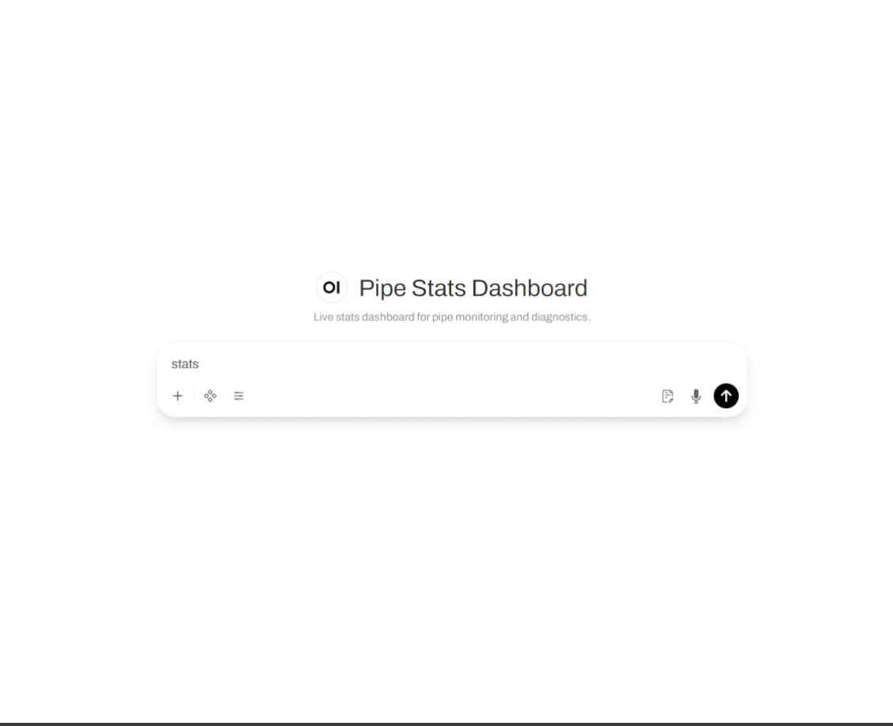

# Pipe Stats Dashboard Plugin -- Developer Guide

> Reference for extending the Pipe Stats Dashboard plugin with custom commands.



---

## Overview

The Pipe Stats Dashboard is a **built-in plugin** that exposes a virtual model in the Open WebUI model dropdown. When selected, messages are interpreted as commands rather than sent to an LLM. It serves as an admin diagnostics tool with a fully dynamic, SSE-powered live dashboard and a reference implementation for the plugin system.

**Prerequisite:** `ENABLE_PLUGIN_SYSTEM` must be `True` (default: `False`). This pipe-level valve controls whether any plugins are loaded. See [Plugin System -- Developer Guide](plugin_system.md).

**Plugin-exported valves** (appear in OWUI Settings when the plugin system is enabled):

| Valve | Type | Default | Scope | Description |
|-------|------|---------|-------|-------------|
| `PIPE_STATS_ENABLE` | bool | `False` | Admin | Show/hide the Pipe Stats Dashboard virtual model in the model selector |

Only users with `role: "admin"` can access the dashboard. Non-admin users who select the model receive an access denied message.

---

## Table of Contents

1. [Overview](#overview)
2. [Architecture](#architecture)
3. [Commands](#commands)
4. [Live Dashboard (SSE)](#live-dashboard-sse)
5. [Command Registration](#command-registration)
6. [CommandContext](#commandcontext)
7. [Command Resolution](#command-resolution)
8. [CommandEntry](#commandentry)
9. [Adding Commands](#adding-commands)
10. [Formatting Utilities](#formatting-utilities)
11. [Running DB Queries from Commands](#running-db-queries-from-commands)
12. [Resolving Model Display Names](#resolving-model-display-names)
13. [Testing Commands](#testing-commands)

---

## Architecture

The Pipe Stats Dashboard plugin lives under `plugins/pipe_stats/` and is organized as follows:

```
plugins/pipe_stats/
├── __init__.py           # Re-export PipeStatsDashboardPlugin
├── plugin.py             # PipeStatsDashboardPlugin class (model injection + request intercept)
├── auth.py               # Authorization helpers (ACCESS_DENIED_MD)
├── context.py            # CommandContext dataclass
├── command_registry.py   # CommandRegistry, CommandEntry, register_command
├── formatters.py         # Markdown/Mermaid output helpers
├── runtime_stats.py      # Tiered data collectors (identity, fast, medium, slow)
├── sse_stats.py          # SSE streaming endpoint for live dashboard
├── ephemeral_keys.py     # Re-export shim for EphemeralKeyStore (canonical: plugins/_utils.py)
├── stats_publisher.py    # Multi-worker payload collection and aggregation
└── commands/
    ├── __init__.py       # Auto-imports command modules
    ├── config_cmd.py     # Built-in: config, config diff
    ├── health_cmd.py     # Built-in: health
    ├── help_cmd.py       # Built-in: help
    └── stats_cmd.py      # Built-in: stats (live dashboard)
```

**Request flow:**

```
User selects "Pipe Stats Dashboard" model in OWUI dropdown
  → types "stats" and sends message
    → PipeStatsDashboardPlugin.on_request() intercepts (model ID matches)
      → Auth check: user.role == "admin"?
        → CommandRegistry.resolve("stats") → (entry, args)
          → entry.handler(CommandContext(...)) → emits HTML dashboard via event_emitter
            → Dashboard connects to SSE endpoint for live updates
```

The plugin subscribes to two hooks at priority **50**:

| Hook | Purpose |
|------|---------|
| `on_models` | Appends `{"id": "pipe-stats", "name": "Pipe Stats Dashboard"}` to the model list |
| `on_request` | Intercepts requests sent to the `pipe-stats` model ID |

---

## Commands

The plugin ships with five built-in commands across four modules:

| Command | Description |
|---------|-------------|
| `help` | Show available commands and their descriptions |
| `stats` | Launch the live SSE-powered dashboard |
| `config` | Show all valve settings |
| `config diff` | Show only non-default valve settings |
| `health` | Show system health status |

Type any command after selecting the "Pipe Stats Dashboard" model in the OWUI dropdown. An empty message or unrecognized command defaults to `help`.

---

## Live Dashboard (SSE)

The `stats` command emits an HTML shell containing an empty dashboard layout. All data is populated dynamically via Server-Sent Events (SSE), with tiered update frequencies. This is a fully dynamic dashboard — no static data is embedded in the HTML. Everything arrives via the SSE stream.

### How It Works — The SSE Transport Architecture

Open WebUI pipes run as Python functions inside OWUI's process. They have no HTTP server of their own. The Pipe Stats Dashboard solves this by **dynamically registering a FastAPI route on OWUI's own application** at plugin init time:

```
Plugin init (on_init)
  │
  ▼
register_sse_route() → imports OWUI's FastAPI app (open_webui.main.app)
  │                  → registers GET /api/pipe/stats/{key}
  │                  → calls ensure_route_before_spa() to push SPA catch-all to end
  ▼
Stats command ("stats")
  │
  ▼
Generates ephemeral key → embeds in HTML → emits HTML via event_emitter
  │
  ▼
Dashboard HTML loads in OWUI's message area
  │
  ▼
JavaScript creates EventSource('/api/pipe/stats/{KEY}')
  │
  ▼
SSE endpoint validates key → starts streaming tiered data payloads
  │
  ▼
Dashboard JS updates DOM sections as data arrives
```

**Key insight:** The pipe effectively "borrows" OWUI's web server to serve its own API endpoints. The `ensure_route_before_spa()` utility ensures the dynamically-registered route is matched before OWUI's SPA catch-all (`SPAStaticFiles` mount at `/`), which would otherwise swallow all requests. This is the same pattern used by the Think Streaming plugin.

### Data Tiers

Data collection is split into tiers to balance freshness against collection cost:

| Tier | Frequency | Data | Collection Cost |
|------|-----------|------|-----------------|
| **Identity** | Once (tick 0) | Version, pipe ID, worker count | Negligible |
| **Fast** | Every 2s | Concurrency, queues, rate limits, sessions, uptime, PID | Cheap (in-memory reads) |
| **Medium** | Every ~16s | Models catalog status, system health | Moderate (subsystem inspection) |
| **Slow** | Every ~60s | Storage stats, configuration, plugins | Expensive (DB queries via threadpool) |

The `runtime_stats.py` module implements each tier as a separate collector function. Collectors read directly from pipe internals (`ctx.pipe._circuit_breaker`, `ctx.pipe._request_queue`, etc.) — they have full access via `PluginContext.pipe`.

### Multi-Worker Aggregation

In multi-worker deployments (multiple uvicorn workers behind a load balancer), each worker only sees its own process state. The dashboard uses Redis for cross-worker aggregation:

1. **Stats publisher** (`stats_publisher.py`): A background `asyncio.Task` running in each worker. When an SSE session is active, it collects local stats and publishes them to Redis under a worker-specific key with a compact field mapping.
2. **SSE endpoint** (`sse_stats.py`): When serving an SSE request, the endpoint reads all worker keys from Redis, merges the data, and includes a `workers` section in the response.
3. **Idle mode**: When no SSE sessions are active, the publisher drops to a single `EXISTS` check every 5 seconds — near-zero overhead.

In single-worker mode (no Redis), the SSE endpoint reads stats directly from the local process.

### Dashboard Sections

The dashboard is organized into tabs:

**Live Tab:**
- **Concurrency** -- Active requests/tools with progress bars, session count
- **Queues** -- Request queue, log queue, archive queue depths
- **User Circuit Breakers** -- Summary table of request/tool/auth circuit breaker states

**System Tab:**
- **Models** -- Catalog status (loaded count, cache, last fetch, failures)
- **System Health** -- Initialization state, HTTP session, logging, Redis, retention
- **Workers** -- Per-worker status in multi-worker (Redis) deployments

**Storage Tab:**
- **Storage Overview** -- Total items, sizes, encryption/compression modes
- **By Type** -- Artifact counts and sizes grouped by type
- **By Model** -- Scrollable table of per-model usage stats

**About Tab:**
- **Configuration** -- Key valve settings (endpoint, breaker, timing, cleanup)
- **Plugins** -- Registered plugins list

### SSE Protocol

Each SSE event is a JSON object. Keys are present only when that tier fires:

```json
{
  "tick": 5,
  "concurrency": {"active_requests": 2, "max_requests": 50, "...": "..."},
  "queues": {"requests": 0, "requests_max": 1000, "...": "..."},
  "rate_limits": {"tracked_users": 3, "tripped_users": 0, "...": "..."},
  "sessions": {"active": 1},
  "uptime_s": 3600.5,
  "pid": 12345
}
```

On tick 0, all tiers fire simultaneously for instant dashboard population. The JavaScript checks key existence and updates only the sections whose data arrived in that tick.

### Ephemeral Key Authentication

SSE connections are authenticated using `EphemeralKeyStore` (from `plugins/_utils.py`) with optional Redis dual-write for multi-worker support:

1. **Key generation**: When the `stats` command fires, `await key_store.async_generate()` creates a 256-bit cryptographic key via `secrets.token_hex(32)`, stores it locally, and writes it to Redis (if configured). The `key_store` is the plugin's `_key_store` instance of `EphemeralKeyStore`.
2. **Key embedding**: The key is embedded in the HTML dashboard's JavaScript as a URL parameter: `EventSource('/api/pipe/stats/{KEY}')`.
3. **Key validation**: The SSE endpoint calls `await key_store.async_validate(key)` on each tick. Local dict is checked first (fast path). On a local miss, Redis is queried — a hit imports the key to the local dict for subsequent fast-path access. Invalid or expired keys cause the SSE stream to yield `{"status": "expired"}` and close gracefully.
4. **TTL expiry**: Keys expire after 5 minutes of inactivity. The store caps at 10 active keys to prevent resource exhaustion. Redis keys have a matching TTL that is refreshed on each validation.
5. **Multi-worker**: When Redis is configured (automatic in multi-worker deployments), keys are shared across all workers. A key generated on Worker A is visible to Workers B/C/D via Redis fallback. In single-worker mode (no Redis), behavior is identical to a plain process-local dict.

This pattern provides authentication without requiring the user to pass their OWUI session token to the SSE endpoint, avoiding token exposure in URLs and server logs.

---

## Command Registration

Commands are registered using the `@register_command` decorator, which is a convenience alias for `CommandRegistry.register`:

```python
# plugins/pipe_stats/commands/my_cmd.py
from ..command_registry import register_command
from ..context import CommandContext


@register_command(
    "mycommand",
    summary="Short description for help listing",
    category="General",
    usage="mycommand [args]",
    aliases=["mc"],
)
async def handle_mycommand(ctx: CommandContext) -> str:
    """Longer docstring (not shown in help)."""
    pipe = ctx.pipe
    args = ctx.args      # Remaining text after command prefix
    user = ctx.user      # Open WebUI user dict
    metadata = ctx.metadata

    return "## My Command Output\n\nHello!"
```

**Decorator parameters:**

| Parameter | Type | Required | Description |
|-----------|------|:--------:|-------------|
| `name` | `str` | Yes | Primary command name (lowercased on registration) |
| `summary` | `str` | No | One-line description shown in `help` output |
| `usage` | `str` | No | Usage pattern shown in help (e.g., `"mycommand [args]"`) |
| `category` | `str` | No | Grouping for the help listing (default: `"General"`) |
| `aliases` | `list[str]` | No | Alternative names that also resolve to this command |

The handler function must be `async` and return a markdown string. The return value is wrapped in a `chat.completion` response dict by the plugin.

---

## CommandContext

Every command handler receives a `CommandContext` instance:

```python
@dataclass
class CommandContext:
    pipe: Pipe                    # Full pipe reference
    args: str                     # Remaining args after command match
    user: dict[str, Any]          # __user__ dict from Open WebUI
    metadata: dict[str, Any]      # __metadata__ dict from Open WebUI
    event_emitter: Any = None     # OWUI event emitter for HTML embeds
```

| Field | Description |
|-------|-------------|
| `pipe` | The full `Pipe` instance. Provides access to `pipe.valves`, `pipe._artifact_store`, `pipe._circuit_breaker`, and all `_ensure_*()` lazy subsystems. This is an admin-only tool -- dig into anything. |
| `args` | The text remaining after the command prefix was matched. For input `"stats extra"` matched against command `"stats"`, `args` is `"extra"`. |
| `user` | The Open WebUI user dict containing `role`, `id`, `name`, `email`. Always an admin by the time command handlers run (auth is checked before dispatch). |
| `metadata` | The Open WebUI request metadata dict. |
| `event_emitter` | The OWUI event emitter callable for rich UI embeds (HTML iframes). Used by the `stats` command to emit the dashboard shell. |

---

## Command Resolution

The `CommandRegistry.resolve(text)` method uses **longest-prefix matching**. Command names and aliases are **lowercased** on both registration and resolution (case-insensitive matching, but remaining args preserve original casing).

```
Input: "stats extra"
  ↓
Tries: "stats extra" → no match
       "stats"       → MATCH (entry: "stats", args: "extra")
```

This allows multi-word commands to coexist with shorter commands. Longest-prefix matching ensures the most specific command is preferred.

**Resolution algorithm:**

```python
# Simplified from command_registry.py
for cmd_name, entry in cls._commands.items():
    if normalized == cmd_name or normalized.startswith(cmd_name + " "):
        if len(cmd_name) > best_len:
            best_entry = entry
            best_len = len(cmd_name)
```

If no command matches, `resolve()` returns `(None, "")` and the plugin responds with an "Unknown command" message suggesting `help`.

---

## CommandEntry

Each registered command is stored as a `CommandEntry` dataclass:

```python
@dataclass
class CommandEntry:
    name: str                     # Primary command name
    handler: CommandHandler        # async (CommandContext) -> str
    summary: str                  # One-line description
    usage: str                    # Usage pattern for help
    category: str                 # Grouping (General, Diagnostics, etc.)
    aliases: list[str]            # Alternative names
```

`CommandHandler` is typed as `Callable[[CommandContext], Awaitable[str]]`.

The `CommandRegistry` stores entries in a class-level dict `_commands: dict[str, CommandEntry]`. Both the primary name and all aliases are keyed in this dict (lowercased), pointing to the same `CommandEntry` instance.

---

## Adding Commands

### Step 1: Create the command file

```python
# plugins/pipe_stats/commands/my_cmd.py
from __future__ import annotations
from ..command_registry import register_command
from ..context import CommandContext


@register_command("mycommand", summary="Do something", category="General")
async def handle_mycommand(ctx: CommandContext) -> str:
    return "## My Command\n\nDone."
```

### Step 2: Add explicit import

Add an import line in `plugins/pipe_stats/commands/__init__.py` for bundle compatibility (compressed bundles cannot use `pkgutil` auto-discovery):

```python
from . import my_cmd as _my_cmd  # noqa: E402, F401
```

### Multi-word commands

Commands with spaces are supported. Register them with the full name:

```python
@register_command("mycommand details", summary="Show details", category="General")
async def handle_mycommand_details(ctx: CommandContext) -> str:
    return "## Details\n\n..."
```

Both `mycommand` and `mycommand details` can coexist. Longest-prefix matching ensures `mycommand details` is preferred when the input starts with those two words.

---

## Formatting Utilities

The `formatters` module provides helpers for producing consistent command output. Import from the relative path within the `pipe_stats` package:

```python
from ..formatters import (
    markdown_table,    # markdown_table(["Col1", "Col2"], [["a", "b"]])
    format_bytes,      # format_bytes(2621440) → "2.5 MB"
    format_duration,   # format_duration(125) → "2.1m"
    humanize_type,     # humanize_type("function_call") → "Function Call"
    mask_sensitive,    # mask_sensitive("sk-abc123xyz") → "***3xyz"
    collapsible,       # collapsible("Summary", "Content") → <details>...</details>
    mermaid_pie,       # mermaid_pie("Title", {"A": 10}) → ```mermaid pie ...```
    mermaid_bar,       # mermaid_bar("Title", "X", "Y", ["a"], [1]) → xychart
)
```

### Function signatures

**`markdown_table(headers, rows)`** -- Build a pipe-delimited markdown table. Pipe characters in cell values are auto-escaped.

```python
markdown_table(["Model", "Requests"], [["gpt-4o", "42"], ["claude-3", "17"]])
# | Model | Requests |
# | --- | --- |
# | gpt-4o | 42 |
# | claude-3 | 17 |
```

**`format_bytes(n)`** -- Human-readable byte count.

```python
format_bytes(0)           # "0 B"
format_bytes(1536)        # "1.5 KB"
format_bytes(2_621_440)   # "2.5 MB"
format_bytes(5_368_709_120)  # "5.0 GB"
```

**`format_duration(seconds)`** -- Human-readable duration.

```python
format_duration(5.2)    # "5.2s"
format_duration(125)    # "2.1m"
format_duration(7200)   # "2.0h"
```

**`humanize_type(raw_type)`** -- Convert snake_case artifact types to display labels. Uses a built-in lookup table with fallback to `str.title()`.

```python
humanize_type("function_call")         # "Function Call"
humanize_type("web_search_call")       # "Web Search"
humanize_type("image_generation_call") # "Image Generation"
```

**`mask_sensitive(value, visible_chars=4)`** -- Mask secrets, showing only the last N characters.

```python
mask_sensitive("sk-or-v1-abc123xyz")  # "***3xyz"
mask_sensitive("short")               # "***hort"
mask_sensitive("ab")                  # "***"
```

**`collapsible(summary, content)`** -- Wrap content in an HTML `<details>` block. The summary text is HTML-escaped.

```python
collapsible("Click to expand", "Hidden content here")
# <details>
# <summary>Click to expand</summary>
#
# Hidden content here
#
# </details>
```

**`mermaid_pie(title, data)`** -- Generate a Mermaid pie chart code block.

```python
mermaid_pie("Usage by Model", {"GPT-4o": 42, "Claude 3": 17})
# ```mermaid
# pie title Usage by Model
#     "GPT-4o" : 42
#     "Claude 3" : 17
# ```
```

**`mermaid_bar(title, x_label, y_label, categories, values)`** -- Generate a Mermaid xychart-beta bar chart.

```python
mermaid_bar("Requests", "Model", "Count", ["GPT-4o", "Claude"], [42, 17])
# ```mermaid
# xychart-beta
#     title "Requests"
#     x-axis Model ["GPT-4o", "Claude"]
#     y-axis "Count"
#     bar [42, 17]
# ```
```

---

## Running DB Queries from Commands

Commands that need database access (e.g., storage stats) must use `run_in_threadpool` to avoid blocking the async event loop. Access the artifact store's SQLAlchemy session factory through `ctx.pipe._artifact_store`:

```python
from fastapi.concurrency import run_in_threadpool
from sqlalchemy import func

async def handle_my_storage_cmd(ctx: CommandContext) -> str:
    store = ctx.pipe._artifact_store
    session_factory = getattr(store, "_session_factory", None)
    item_model = getattr(store, "_item_model", None)

    if session_factory is None or item_model is None:
        return "Artifact store not initialized."

    def _query():
        from open_webui_openrouter_pipe.storage.persistence import _db_session
        with _db_session(session_factory) as session:
            total = session.query(func.count(item_model.id)).scalar() or 0
            return total

    total = await run_in_threadpool(_query)
    return f"**Total artifacts:** {total:,}"
```

**Key points:**
- The `_db_session` context manager handles connection lifecycle (open, commit/rollback, close).
- Always check that `_session_factory` and `_item_model` are not `None` -- the artifact store may not be initialized in all environments.
- Wrap the synchronous SQLAlchemy query in a plain `def` and run it via `run_in_threadpool`.

---

## Resolving Model Display Names

Commands that display model information (e.g., usage stats) often need to map raw model IDs (like `openai/gpt-4o`) to human-readable display names (like `GPT-4o`). Use the `OpenRouterModelRegistry`:

```python
from open_webui_openrouter_pipe.models.registry import OpenRouterModelRegistry

def _build_model_name_map() -> dict[str, str]:
    """Map model IDs to display names."""
    id_to_name: dict[str, str] = {}
    for m in OpenRouterModelRegistry.list_models():
        name = m.get("name", "")
        if not name:
            continue
        for key in ("id", "norm_id", "original_id"):
            mid = m.get(key)
            if mid:
                id_to_name[mid] = name
    return id_to_name

# Usage in a command handler:
# name_map = _build_model_name_map()
# display = name_map.get(stored_model_id, stored_model_id)
```

This maps all known ID variants (`id`, `norm_id`, `original_id`) to the same display name, so lookups work regardless of which ID form was stored.

---

## Testing Commands

### Test Setup

Use the same mock infrastructure as plugin tests. The key fixtures reset both the `PluginRegistry` and the `CommandRegistry` between tests:

```python
import logging
from unittest.mock import Mock
import pytest
from open_webui_openrouter_pipe.plugins.base import PluginContext
from open_webui_openrouter_pipe.plugins.registry import PluginRegistry
from open_webui_openrouter_pipe.plugins.pipe_stats.command_registry import CommandRegistry


@pytest.fixture(autouse=True)
def _clean_registries():
    """Reset registries between tests to avoid cross-contamination."""
    original_plugins = PluginRegistry._plugin_classes[:]
    original_valve_fields = dict(PluginRegistry._pending_valve_fields)
    original_user_valve_fields = dict(PluginRegistry._pending_user_valve_fields)
    original_commands = dict(CommandRegistry._commands)
    yield
    PluginRegistry._plugin_classes.clear()
    PluginRegistry._plugin_classes.extend(original_plugins)
    PluginRegistry._pending_valve_fields.clear()
    PluginRegistry._pending_valve_fields.update(original_valve_fields)
    PluginRegistry._pending_user_valve_fields.clear()
    PluginRegistry._pending_user_valve_fields.update(original_user_valve_fields)
    CommandRegistry._commands = original_commands


def _make_mock_pipe():
    """Create a minimal mock Pipe for plugin tests."""
    pipe = Mock()
    pipe.id = "test-pipe"
    pipe.valves = Mock()
    pipe.valves.ENABLE_PLUGIN_SYSTEM = True
    pipe.valves.model_fields = {}
    pipe._artifact_store = Mock()
    pipe._artifact_store._session_factory = None
    pipe._artifact_store._item_model = None
    pipe._circuit_breaker = Mock()
    pipe._circuit_breaker._open_circuits = {}
    pipe._redis_client = None
    pipe._redis_enabled = False
    pipe._request_queue = None
    pipe._catalog_manager = None
    pipe._http_session = None
    return pipe
```

### Writing Command Tests

Test commands by constructing a `CommandContext` with a mock pipe, then calling the handler function directly:

```python
from open_webui_openrouter_pipe.plugins.pipe_stats.context import CommandContext

class TestMyCommand:
    @pytest.mark.asyncio
    async def test_mycommand_output(self):
        pipe = _make_mock_pipe()
        ctx = CommandContext(pipe=pipe, args="", user={"role": "admin"}, metadata={})

        from open_webui_openrouter_pipe.plugins.pipe_stats.commands.my_cmd import handle_mycommand
        result = await handle_mycommand(ctx)
        assert "My Command" in result

    @pytest.mark.asyncio
    async def test_mycommand_with_args(self):
        pipe = _make_mock_pipe()
        ctx = CommandContext(pipe=pipe, args="--verbose", user={"role": "admin"}, metadata={})

        from open_webui_openrouter_pipe.plugins.pipe_stats.commands.my_cmd import handle_mycommand
        result = await handle_mycommand(ctx)
        assert isinstance(result, str)
```

**Testing tips:**
- Import the handler function directly, not via `CommandRegistry.resolve()`. This isolates the test to the handler logic.
- To test command resolution, use `CommandRegistry.resolve("mycommand args")` and assert on the returned `(entry, remaining_args)` tuple.
- The `_clean_registries` fixture prevents command registration from leaking between test files.

---

## See Also

- [Plugin System -- Developer Guide](plugin_system.md) -- Hook system reference, plugin lifecycle, `PluginContext`, priority system, and general plugin development patterns.
- [Think Streaming Plugin](plugins_think_streaming.md) -- Live reasoning and tool execution display using the same SSE transport pattern.
